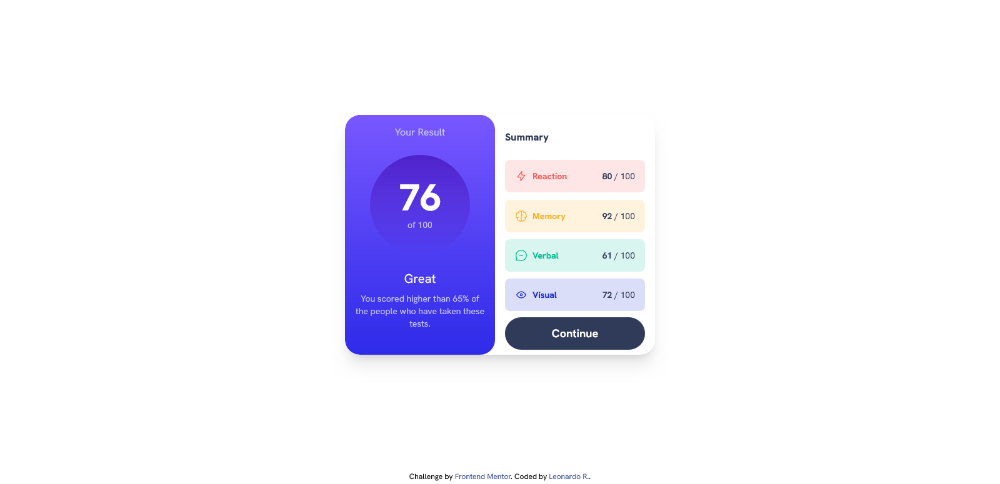

# Frontend Mentor - Results summary component solution

This is a solution to the [Results summary component challenge on Frontend Mentor](https://www.frontendmentor.io/challenges/results-summary-component-CE_K6s0maV). Frontend Mentor challenges help you improve your coding skills by building realistic projects. 

## Table of contents

- [Overview](#overview)
  - [The challenge](#the-challenge)
  - [Screenshot](#screenshot)
  - [Links](#links)
- [My process](#my-process)
  - [Built with](#built-with)
  - [What I learned](#what-i-learned)
  - [Continued development](#continued-development)
  - [Useful resources](#useful-resources)
- [Author](#author)

## Overview

A results summary component created with Tailwind CSS and JavaScript 

### The challenge

The challenge is to build out this results summary component and get it looking as close to the design as possible.

You can use any tools you like to help you complete the challenge. So if you've got something you'd like to practice, feel free to give it a go.

We provide the data for the results in a local `data.json` file. So you can use that to add the results and total score dynamically if you choose.

Your users should be able to:

- View the optimal layout for the interface depending on their device's screen size
- See hover and focus states for all interactive elements on the page
- **Bonus**: Use the local JSON data to dynamically populate the content

### Screenshot

### Links

- Live Site URL: [GitHub Pages](https://leozende.github.io/results-summary-component/)

## My process

Trying to make the html more semantic was my first objective, although I ended up needing to create some divs in the future to complement it.
After that, with the tailwind CSS website on the side, I styled the page while searching the site.
Finally, I did the JavaScript part to read the Json and make the page more dynamic.

### Built with

- Semantic HTML5 markup
- TailWind CSS custom properties
- Flexbox
- CSS Grid
- Mobile-first workflow
- JavaScript
- Json

### What I learned

Well, at first I learned better how Tailwind CSS works.
As an extra, I also reinforced my knowledge of javascript, focused on reading json.

### Continued development

The javascript part needs to be improved and, seeing how tailwind works and how html has become, I should try to use it with a framework to create components instead of using it in this direct way.

### Useful resources

- [Tailwind CSS site](https://tailwindcss.com) - What I used most for tailwind.
- [HTML Semantics](https://developer.mozilla.org/en-US/docs/Glossary/Semantics) - I used it to try to make the site more semantic
- [Custom Colors](https://csstailwind.com/2-ways-to-add-custom-colors-in-tailwindcss/#:~:text=You%20can%20add%20a%20custom,than%20once%20in%20your%20project.) - When I needed to use new colors and, when adding them directly to the theme, they ended up deleting the pre-configured ones, so I discovered that it was necessary to add them to the extend.

## Author

- Website - [Leonardo R](https://github.com/leozende)
- Frontend Mentor - [@leozende](https://www.frontendmentor.io/profile/leozende)
